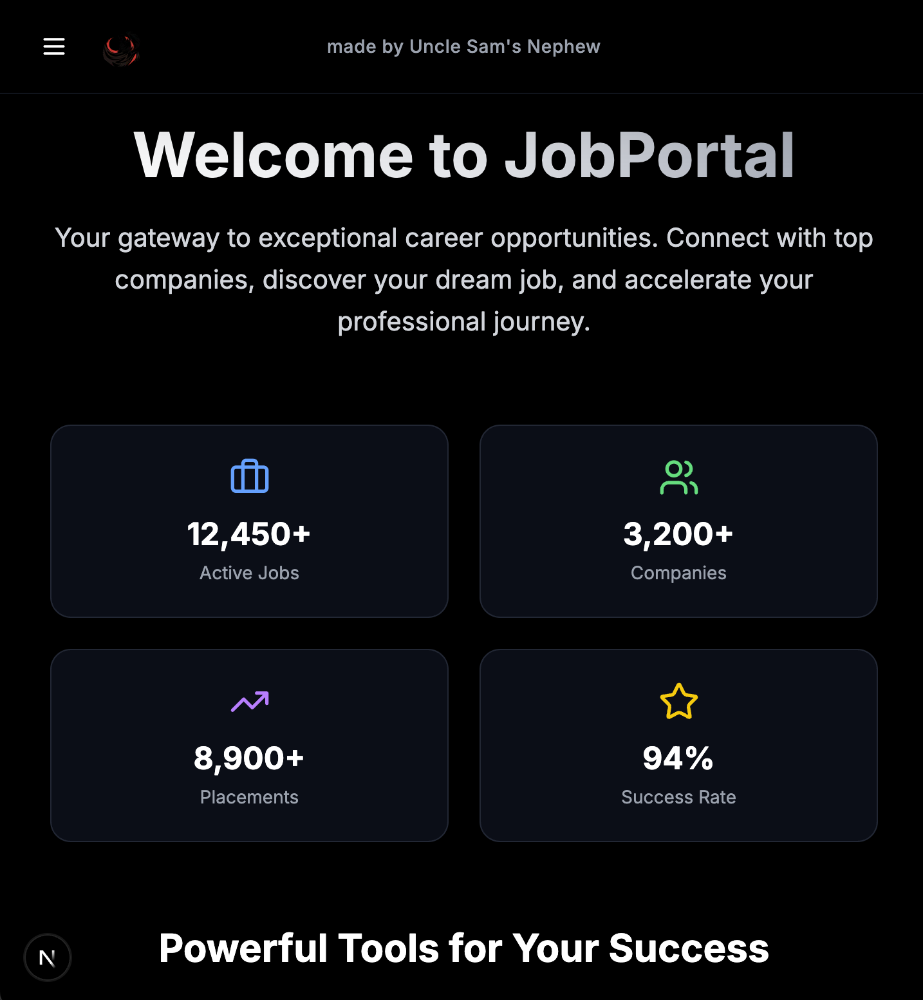
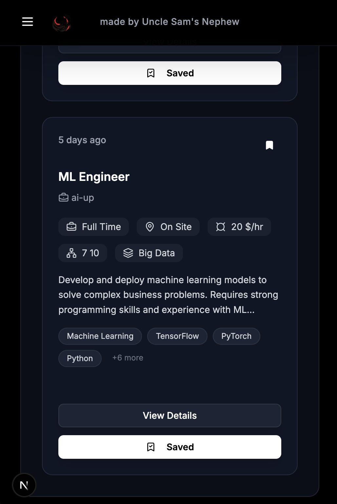

🚀 Modern Job Portal

A comprehensive, full-stack job portal skeleton built with Next.js 15, featuring advanced search capabilities, user authentication, AI-powered content generation, and a modern glassmorphism UI design. This project serves as a flexible foundation that can be easily customized, extended, or modified to suit your specific requirements.

<div align="center">
  
  
</div>

✨ Features

🔍 **Advanced Job Search & Filtering**
- Smart search with debounced input
- Multi-criteria filtering (category, experience, work mode, shift timing)
- Real-time results with instant feedback
- Responsive search interface for all devices

👤 **User Authentication & Profiles**
- Secure authentication powered by Clerk
- User profile management with personal information
- Application tracking and history
- Protected routes and role-based access

💼 **Job Management**
- Comprehensive job listings with detailed information
- Company profiles and categorization
- Job saving/bookmarking functionality
- Application submission system

🤖 **AI-Powered Content Generation**
- AI-generated job descriptions for enhanced listings
- Intelligent company descriptions and profiles
- Smart content suggestions and optimizations
- Automated content enhancement tools

🎨 **Modern UI/UX Design**
- Glassmorphism design with backdrop blur effects
- Dark theme with sophisticated color palette
- Responsive design for all screen sizes
- Smooth animations and micro-interactions
- Accessible components following WCAG guidelines

📧 **Email Integration**
- Automated email notifications
- Application confirmation emails
- Welcome emails for new users

🛠️ Tech Stack

**Frontend**
- **Next.js 15** - React framework with App Router
- **React 18** - UI library with latest features
- **TypeScript** - Type-safe development
- **Tailwind CSS** - Utility-first CSS framework
- **Tailwind Animate** - Beautiful animations
- **Framer Motion** - Advanced animations and gestures
- **Lucide React** - Modern icon library

**Backend & Database**
- **Prisma** - Type-safe database ORM
- **MongoDB** - NoSQL database for flexible data storage
- **Server Actions** - Next.js server-side functions
- **API Routes** - RESTful API endpoints

**Authentication & Security**
- **Clerk** - Complete authentication solution
- **Protected Routes** - Secure user areas
- **Role-based Access** - User permissions system

**AI Integration**
- **AI-Powered Content Generation** - Job and company descriptions
- **Smart Content Enhancement** - Automated content optimization
- **Intelligent Recommendations** - AI-driven job matching

**Form Handling & Validation**
- **React Hook Form** - Performant form library
- **Zod** - Schema validation
- **Form Validation** - Client and server-side validation

**UI Components**
- **Radix UI** - Accessible component primitives
- **CMDK** - Command palette interface
- **React Hot Toast** - Notification system
- **Class Variance Authority** - Dynamic class management

**Email Services**
- **Nodemailer** - Email sending functionality
- **Email Templates** - HTML email templates

📁 Project Structure
```
job-portal/
├── actions/                          # Server actions
│   ├── get-jobs.ts                   # Fetch jobs data
│   └── get-overview.ts               # Dashboard overview data
│
├── app/                              # Next.js App Router
│   ├── (auth)/                       # Authentication routes group
│   │   ├── (routes)/
│   │   │   ├── sign-in/
│   │   │   │   └── [[...sign-in]]/
│   │   │   │       └── page.tsx      # Sign-in page
│   │   │   └── sign-up/
│   │   │       └── [[...sign-up]]/
│   │   │           └── page.tsx      # Sign-up page
│   │   └── layout.tsx                # Auth layout
│   │
│   ├── (dashboard)/                  # Main application routes
│   │   ├── _components/              # Dashboard shared components
│   │   │   ├── data-filter.tsx       # Data filtering component
│   │   │   ├── logo.tsx              # App logo component
│   │   │   ├── mobile-side-bar.tsx   # Mobile navigation
│   │   │   ├── navbar-routes.tsx     # Navigation routes
│   │   │   ├── navbar.tsx            # Top navigation bar
│   │   │   ├── side-bar-route-item.tsx # Sidebar navigation item
│   │   │   ├── sidebar-routes.tsx    # Sidebar routes configuration
│   │   │   └── sidebar.tsx           # Main sidebar component
│   │   │
│   │   ├── (routes)/
│   │   │   ├── admin/                # Admin panel
│   │   │   │   ├── analytics/
│   │   │   │   │   └── page.tsx      # Analytics dashboard
│   │   │   │   ├── companies/        # Company management
│   │   │   │   │   ├── _components/
│   │   │   │   │   │   └── columns.tsx # Table columns definition
│   │   │   │   │   ├── [companyId]/  # Individual company pages
│   │   │   │   │   │   ├── company-overview.tsx
│   │   │   │   │   │   ├── description-form.tsx
│   │   │   │   │   │   ├── name-form.tsx
│   │   │   │   │   │   ├── page.tsx
│   │   │   │   │   │   ├── social-contacts-form.tsx
│   │   │   │   │   │   └── why-join-us-form.tsx
│   │   │   │   │   ├── create/
│   │   │   │   │   │   └── page.tsx  # Create new company
│   │   │   │   │   └── page.tsx      # Companies listing
│   │   │   │   ├── create/
│   │   │   │   │   └── page.tsx      # Create new job
│   │   │   │   └── jobs/             # Job management
│   │   │   │       ├── _components/
│   │   │   │       │   └── columns.tsx
│   │   │   │       ├── [jobId]/      # Individual job management
│   │   │   │       │   ├── _components/
│   │   │   │       │   │   ├── category-form.tsx
│   │   │   │       │   │   ├── company-form.tsx
│   │   │   │       │   │   ├── horuly-rate-form.tsx
│   │   │   │       │   │   ├── job-description.tsx
│   │   │   │       │   │   ├── job-publish-actions.tsx
│   │   │   │       │   │   ├── shift-timing-mode.tsx
│   │   │   │       │   │   ├── short-description.tsx
│   │   │   │       │   │   ├── tags-form.tsx
│   │   │   │       │   │   ├── title-form.tsx
│   │   │   │       │   │   ├── work-experience-form.tsx
│   │   │   │       │   │   └── work-mode-form.tsx
│   │   │   │       │   ├── applicants/ # Job applicants management
│   │   │   │       │   │   ├── _components/
│   │   │   │       │   │   │   └── columns.tsx
│   │   │   │       │   │   └── page.tsx
│   │   │   │       │   └── page.tsx
│   │   │   │       └── page.tsx      # Jobs listing
│   │   │   ├── page.tsx              # Dashboard home
│   │   │   ├── savedJobs/
│   │   │   │   └── page.tsx          # Saved jobs page
│   │   │   ├── search/               # Job search functionality
│   │   │   │   ├── _components/
│   │   │   │   │   ├── categories-list.tsx
│   │   │   │   │   ├── category-list-item.tsx
│   │   │   │   │   ├── job-card-item.tsx
│   │   │   │   │   └── page-content.tsx
│   │   │   │   ├── [jobId]/          # Job details
│   │   │   │   │   ├── _components/
│   │   │   │   │   │   └── job-details-page-content.tsx
│   │   │   │   │   └── page.tsx
│   │   │   │   └── page.tsx          # Search results
│   │   │   └── user/                 # User profile management
│   │   │       ├── _components/
│   │   │       │   ├── contact-form.tsx
│   │   │       │   ├── email-form.tsx
│   │   │       │   ├── name-form.tsx
│   │   │       │   └── resume-form.tsx
│   │   │       └── page.tsx
│   │   └── layout.tsx                # Dashboard layout
│   │
│   ├── api/                          # API routes
│   │   ├── companies/
│   │   │   ├── [companyId]/
│   │   │   │   └── route.ts          # Company CRUD operations
│   │   │   └── route.ts              # Companies API
│   │   ├── jobs/
│   │   │   ├── [jobId]/
│   │   │   │   ├── publish/
│   │   │   │   │   └── route.ts      # Publish job
│   │   │   │   ├── removeJobFromCollection/
│   │   │   │   │   └── route.ts      # Remove from saved jobs
│   │   │   │   ├── route.ts          # Job CRUD operations
│   │   │   │   ├── savedJobToCollection/
│   │   │   │   │   └── route.ts      # Save job to collection
│   │   │   │   └── unpublish/
│   │   │   │       └── route.ts      # Unpublish job
│   │   │   └── route.ts              # Jobs API
│   │   ├── resumes/
│   │   │   └── route.ts              # Resume upload/management
│   │   ├── thankyou/
│   │   │   └── route.ts              # Thank you page API
│   │   └── users/
│   │       └── [userId]/
│   │           ├── appliedJobs/
│   │           │   └── route.ts      # User's applied jobs
│   │           └── route.ts          # User management
│   │
│   ├── favicon.ico                   # App favicon
│   ├── globals.css                   # Global styles
│   └── layout.tsx                    # Root layout
│
├── components/                       # Reusable components
│   ├── banner.tsx                    # Banner component
│   ├── box.tsx                       # Box container component
│   ├── editor.tsx                    # Rich text editor
│   ├── icon-badge.tsx                # Icon badge component
│   ├── preview.tsx                   # Content preview component
│   ├── search-container.tsx          # Search container
│   └── ui/                           # UI components
│       ├── apply-model.tsx           # Job application modal
│       ├── button.tsx                # Button component
│       ├── card.tsx                  # Card component
│       ├── checkbox.tsx              # Checkbox component
│       ├── combo-box.tsx             # Combobox component
│       ├── command.tsx               # Command component
│       ├── data-table.tsx            # Data table component
│       ├── dialog.tsx                # Dialog component
│       ├── dropdown-menu.tsx         # Dropdown menu
│       ├── form.tsx                  # Form component
│       ├── input.tsx                 # Input component
│       ├── label.tsx                 # Label component
│       ├── list-item.tsx             # List item component
│       ├── model.tsx                 # Modal component
│       ├── popover.tsx               # Popover component
│       ├── select.tsx                # Select component
│       ├── separator.tsx             # Separator component
│       ├── sheet.tsx                 # Sheet component
│       ├── table.tsx                 # Table component
│       └── textarea.tsx              # Textarea component
│
├── hooks/                            # Custom React hooks
│   └── use-debounce.ts               # Debounce hook
│
├── lib/                              # Utility libraries
│   ├── db.ts                         # Database connection
│   ├── generated/                    # Prisma generated files
│   │   └── prisma/                   # Prisma client
│   ├── mail.ts                       # Email utilities
│   └── utils.ts                      # General utilities
│
├── prisma/                           # Database schema
│   └── schema.prisma                 # Prisma schema file
│
├── providers/                        # React context providers
│   └── toast-provider.tsx            # Toast notifications provider
│
├── public/                           # Static assets
│   ├── file.svg                      # File icon
│   ├── globe.svg                     # Globe icon
│   ├── img/
│   │   └── logo.png                  # App logo
│   ├── next.svg                      # Next.js logo
│   ├── vercel.svg                    # Vercel logo
│   └── window.svg                    # Window icon
│
├── scripts/                          # Utility scripts
│   ├── aistudio.ts                   # AI Studio integration
│   └── seeds.ts                      # Database seeding
│
├── components.json                   # shadcn/ui components config
├── eslint.config.mjs                 # ESLint configuration
├── middleware.ts                     # Next.js middleware
├── next.config.mjs                   # Next.js configuration
├── package.json                      # Project dependencies
├── postcss.config.mjs                # PostCSS configuration
├── tailwind.config.ts                # Tailwind CSS configuration
└── tsconfig.json                     # TypeScript configuration
```

🚀 Getting Started

Prerequisites
- **Node.js** 18.x or later
- **npm** or **yarn** or **pnpm**
- **MongoDB** database
- **Clerk** account for authentication

Installation

1. **Clone the repository**
   ```bash
   git clone https://github.com/yourusername/job-portal.git
   cd job-portal
   ```

2. **Install dependencies**
   ```bash
   npm install
     or
   yarn install
     or
   pnpm install
   ```

3. **Environment Setup**
   
   Create a `.env.local` file in the root directory:
   ```env
     Database
   DATABASE_URL="your_mongodb_connection_string"
   
   # Clerk Authentication
   NEXT_PUBLIC_CLERK_PUBLISHABLE_KEY="your_clerk_publishable_key"
   CLERK_SECRET_KEY="your_clerk_secret_key"
   NEXT_PUBLIC_CLERK_SIGN_IN_URL="/sign-in"
   NEXT_PUBLIC_CLERK_SIGN_UP_URL="/sign-up"
   NEXT_PUBLIC_CLERK_AFTER_SIGN_IN_URL="/dashboard"
   NEXT_PUBLIC_CLERK_AFTER_SIGN_UP_URL="/dashboard"
   
   # AI Integration
   AI_API_KEY="your_ai_api_key"
   AI_MODEL="your_preferred_ai_model"
   
   # Email Configuration
   SMTP_HOST="your_smtp_host"
   SMTP_PORT="587"
   SMTP_USER="your_email@example.com"
   SMTP_PASSWORD="your_email_password"
   
   # App Configuration
   NEXT_PUBLIC_APP_URL="http://localhost:3000"
   ```

4. **Database Setup**
   ```bash
   # Generate Prisma client
   npx prisma generate
   
   # Run database migrations
   npx prisma db push
   
   # Seed the database (optional)
   npm run seed
   ```

5. **Start the development server**
   ```bash
   npm run dev
   # or
   yarn dev
   # or
   pnpm dev
   ```

6. **Open your browser**
   Navigate to [http://localhost:3000](http://localhost:3000)

📊 Database Schema

Core Models

```prisma
model User {
  id            String    @id @default(cuid())
  email         String    @unique
  fullName      String?
  imageUrl      String?
  appliedJobs   AppliedJob[]
  createdAt     DateTime  @default(now())
  updatedAt     DateTime  @updatedAt
}

model Job {
  id                String    @id @default(cuid())
  title             String
  description       String?
  aiGenerated       Boolean   @default(false)
  company           Company?  @relation(fields: [companyId], references: [id])
  companyId         String?
  category          Category? @relation(fields: [categoryId], references: [categoryId])
  categoryId        String?
  hourlyRate        String?
  shiftTiming       String?
  workMode          String?
  yearsOfExperience String?
  appliedJobs       AppliedJob[]
  savedUsers        String[]
  createdAt         DateTime  @default(now())
  updatedAt         DateTime  @updatedAt
}

model Company {
  id              String   @id @default(cuid())
  name            String
  logo            String?
  description     String?
  aiGenerated     Boolean  @default(false)
  jobs            Job[]
  createdAt       DateTime @default(now())
  updatedAt       DateTime @updatedAt
}

model Category {
  id        String   @id @default(cuid())
  name      String
  jobs      Job[]
  createdAt DateTime @default(now())
  updatedAt DateTime @updatedAt
}
```

🎨 UI Components

Design System

- **Colors**: Dark theme with gray-900 primary and accent colors
- **Typography**: Modern font stack with proper hierarchy
- **Spacing**: Consistent 8px grid system
- **Borders**: Rounded corners with glassmorphism effects
- **Shadows**: Layered shadow system for depth

Key Components

- **JobCardItem**: Displays job information in card format
- **SearchContainer**: Advanced search with filters
- **ApplyModal**: Job application interface
- **Banner**: Notification and alert system
- **Editor**: Rich text editing capabilities
- **AIContentGenerator**: AI-powered content creation tools

🔧 Available Scripts

```bash
# Development
npm run dev          # Start development server
npm run build        # Build for production
npm run start        # Start production server
npm run lint         # Run ESLint
npm run type-check   # TypeScript type checking

# Database
npm run db:generate  # Generate Prisma client
npm run db:push      # Push schema to database
npm run db:migrate   # Run database migrations
npm run db:studio    # Open Prisma Studio
npm run seed         # Seed database with sample data

# Utilities
npm run clean        # Clean build files
npm run analyze      # Analyze bundle size
```

🚀 Deployment

# Current Status
I'm actively working on optimizing the deployment process for Vercel and other platforms. Some web extension compatibility improvements are in progress to ensure seamless deployment across different hosting environments.

# Vercel (Recommended)

1. **Connect your repository** to Vercel
2. **Configure environment variables** in Vercel dashboard
3. **Deploy** - Vercel will automatically build and deploy

# Manual Deployment

1. **Build the application**
   ```bash
   npm run build
   ```

2. **Set up your production database**
   ```bash
   npx prisma migrate deploy
   ```

3. **Start the production server**
   ```bash
   npm start
   ```

🔧 Customization & Extension

This project is designed as a flexible skeleton that can be easily modified and extended:

- **Add new features** by creating additional components and pages
- **Modify the database schema** to include custom fields
- **Integrate additional services** for enhanced functionality
- **Customize the UI** to match your brand requirements
- **Extend AI capabilities** with custom content generation
- **Add new authentication providers** beyond Clerk
- **Implement custom business logic** for specific use cases


# Development Workflow

1. **Fork** the repository
2. **Create** a feature branch (`git checkout -b feature/amazing-feature`)
3. **Commit** your changes (`git commit -m 'Add amazing feature'`)
4. **Push** to the branch (`git push origin feature/amazing-feature`)
5. **Open** a Pull Request

# Code Standards

- **TypeScript** for type safety
- **ESLint** for code linting
- **Prettier** for code formatting
- **Conventional Commits** for commit messages


🙏 Acknowledgments

- **Next.js** team for the amazing framework
- **Clerk** for authentication services
- **Prisma** for the excellent ORM
- **Tailwind CSS** for the utility-first CSS framework
- **MongoDB** for the flexible database solution
- **Vercel** for hosting and deployment

🔮 Roadmap

- [ ] **Enhanced AI Features** - Advanced job matching algorithms
- [ ] **Advanced Analytics** - Job application analytics dashboard
- [ ] **Video Interviews** - Integrated video calling system
- [ ] **Company Reviews** - User-generated company reviews
- [ ] **Mobile App** - React Native mobile application
- [ ] **Multi-language Support** - Internationalization
- [ ] **Advanced Notifications** - Push notifications and email alerts
- [ ] **Deployment Optimization** - Streamlined deployment process
